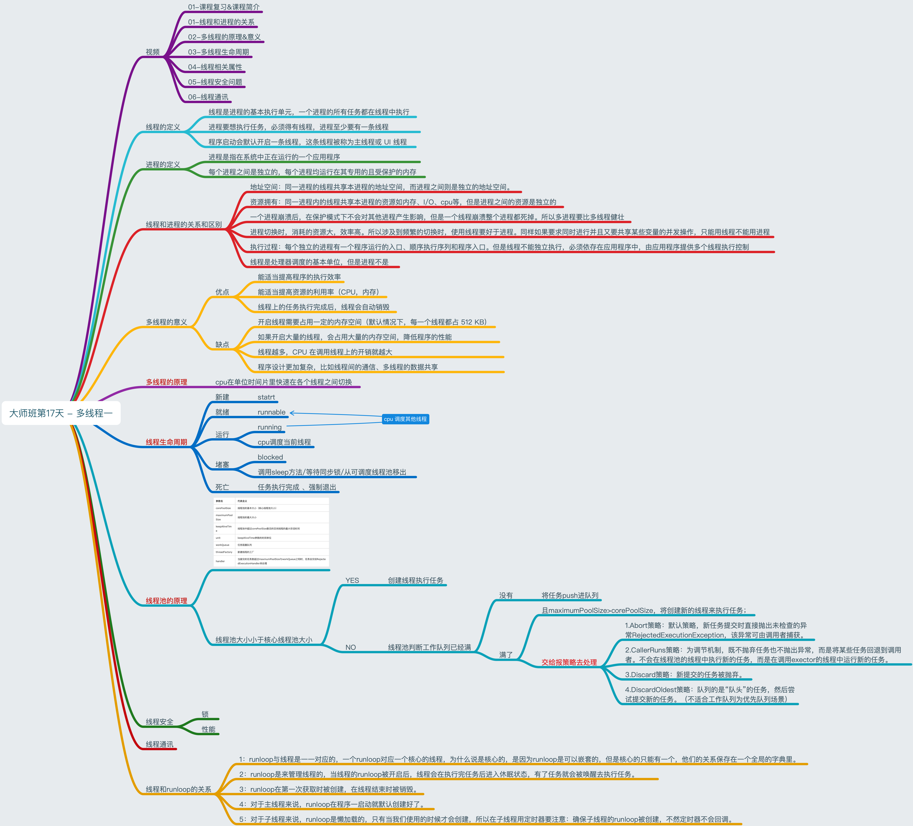

## 总结
`GCD`底层有一个线程池，这个池中存放的是一个个线 程，`池`中的线程可以重用，当一段时间后这个线程没有被调用，这个线程就会被销毁，注意，开多少个线程是 由线程池决定的，池是系统自动维护的，不需要程序员维护，程序员只需要向队列中添加任务，队列调度即可。
如果队列中存放的是同步任务，则任务出队后，底层线 程池会提供一条线程供这个任务执行，任务执行完毕后这 条线程再回到线程池，这样队列中的任务反复调度,因为是同步的，所以我们用`currentThread`打印的时候，是同一个线程。如果队列中的任务存放的是异步任务，当任务出队后，底层线程池会提供一个线程供任务执行，因为是异步执行，队列中的任务不需要等待当前任务执行完毕就可以调度下一个任务，这时底层线程池中会再次提供一个线程供第二个任务执行，执行完毕后再回到底层线程池中。这样就对一个线程完成一个复用，而不需要每一个任务 执行都开启新线程，也就节约了系统的开销，提高了效率。`iOS7`的时候，使用`GCD`系统通常只能开**5-8条线程**， iOS8以后，系统可以开多个线程，但是在实际开发中， 建议开启的线程数为**3-5条**。

### 1. 进程与线程
 <details>
  <summary>点击查看详细内容</summary>
 
 
#### 进程: 
- 1、进程是一个具有一定独立功能的程序关于某次数据集合的一次运行活动，它是操作系统分配资源的基本单元。
- 2、进程是指在系统中正在运行的一个应用程序，就是一段程序执行过程，我们可以理解为手机上的app. 
- 3、 每个进程之间是独立，每个进程均运行在其专用且受保护 的内存空间内，拥有独立运行所需的全部资源。
- 4. iOS APP是单进程的。


#### 线程:
- 1. 线程是进程的基本执行单元，一个进程的所有任务都在线程中执行
- 2. 进程想要执行任务，必须得有线程，进程至少要有一条线程
- 3. 程序启动默认开启一条线程，这条线程被称为主线程或者UI线程。

#### 进程和线程的关系
- 1、线程是进程的执行单元，进程所有的任务都在线程中执行
- 2、一个程序可以对应多个进程(多进程)，一个进程中可有多个线程，但至少要有一条线程。
- 3、同一个进程内的线程共享进程资源。


#### 区别
 - **地址空间：同一进城的线程共享进程的地址空间，而进程之间则是独立的地址空间。**
 - **资源拥有：** 统一进程内的线程共享本进程的资源，如内存，I/O，cpu等，但是进程之间的资源是独立的。
 - 一个进程崩溃后，在保护模式下不会对其他进程产生影响，但是一个线程崩溃整个进程都死掉。所以多进程要比多线程健壮。
 - 进程切换时，消耗的资源大，效率高，所以设计到频繁的切换时，使用线程要好于进程。同样如果要求同时进行并且又要共享某些变量的并发操作，只能用线程不能用进程。
 - **执行过程**：每个独立的进程有一个程序运行的入口，顺序执行序列和程序入口。但是线程不能独立执行，必须存在应用程序中，由应用程序提供多个线程执行控制。
 - **线程是处理调度的基本单位，但是进程不是。**

</details>


### 2. 多线程优点与缺点 并发与并行
 <details>
  <summary>点击查看详细内容</summary>

  多线程的实现原理:
  事实上，同一时间内单核`CPU`只能 执行一个线程，多线程是`CUP`快速的在多个线程之间切换，造成了多个线程同时执行的假象。
如果是**多核**`CPU`就真的可以同时处理多个线程了。
 多线程的目的是为了同步完成多项任务，通过提高系统
的资源利用率来提高系统的效率。
多线程的优点和缺点?
优点:
能适当提高程序的执行效率 能适当提高资源利用率(CPU、内存利用率)
缺点:
1. 开启线程会占用一定的内存空间(默认情况下，主 线程占用1M,子线程512KB),如果开启大量的线程，会 占用大量的内存空间，降低程序的性能。
2. 线程越多，`CPU`在调度线程上的开销就越大
3. 多线程的并行和并发有什么区别?
 
-  **并行:充分利用计算机的多核，在多个线程上同步进行**

-  **并发:在一条线程上通过快速切换，让人感觉在同步执行**


</details>

### 3. 死锁
 <details>
  <summary>点击查看详细内容></summary>
  
**死锁是由于多个线程(进程)在执行过程中，因为争夺资源而造成的互相等待的现象**


同步队列在输出2的时候进行了同步执行，则会死锁。
如果换成并发队列则可以。

```objc
	dispatch_queue_t queue=  dispatch_queue_create("com.fgyong.cn", DISPATCH_QUEUE_SERIAL);
	dispatch_async(queue, ^{
		NSLog(@"1");
		dispatch_sync(queue, ^{
			NSLog(@"2");
		});
		NSLog(@"3");
	});
	NSLog(@"4");
```
更正后的代码：同步执行改为异步执行

```objc
dispatch_queue_t queue=  dispatch_queue_create("com.fgyong.cn", DISPATCH_QUEUE_SERIAL);
	dispatch_async(queue, ^{
		NSLog(@"1");
		dispatch_async(queue, ^{
			NSLog(@"2");
		});
		NSLog(@"3");
	});
	NSLog(@"4");
```

或者改为异步队列：

```objc
	dispatch_queue_t queue=  dispatch_queue_create("com.fgyong.cn", DISPATCH_QUEUE_CONCURRENT);
	dispatch_async(queue, ^{
		NSLog(@"1");
		dispatch_sync(queue, ^{
			NSLog(@"2");
		});
		NSLog(@"3");
	});
	NSLog(@"4");
```

</details>

### 4. GCD执行原理
 <details>
  <summary>点击查看详细内容</summary>
  
  `GCD`底层有一个线程池，这个池中存放的是一个个线 程，”池“中的线程可以重用，当一段时间后这个线程没 有被调用，这个线程就会被销毁，注意，开多少个线程是由线程池决定的，池是系统自动维护的，不需要程序员维护，程序员只需要向队列中添加任务，队列调度即可。
如果队列中存放的是同步任务，则任务出队后，底层线程池会提供一条线程供这个任务执行，任务执行完毕后这条线程再回到线程池，这样队列中的任务反复调度，因为是同步的，所以我们用`currentThread`打印的时候，是同一个线程。如果队列中的任务存放的是异步任务，当任务出队后，底层线程池会提供一个线程供任务执行，因为是异步执行，队列中的任务不需要等待当前任务执就可以调度下一个任务，这时底层线程池中会再次提供一个线程供第二个任务执行，执行完毕后再回到底层线程池中。这样就对一个线程完成一个复用，而不需要每一个任务执行都开启新线程，也就节约了系统的开销，提高了效率。iOS7的时候，使用`GCD`系统通常只能开**5-8**条线程， iOS8以后，系统可以开多个线程，但是在实际开发中， 建议开启的线程数为**3-5**条。
</details>


###  5. GCD与NSOperation 区别

 <details>
  <summary>点击查看详细内容</summary>
  <table>
  <tr>
  <td>方案</td>
  <td>简介</td>
  <td>语言</td>
  <td>线程声明周期</td>
  <td>使用频率</td>
  </tr>
  
   <tr>
  <td>pthread</td>
  <td> 一套通用的多线程API,适用于Unix/Linux/Windows方案，跨平台，使用难度大
   </td>
  <td>C语言</td>
  <td>程序员管理</td>
  <td>几乎不用</td>
  </tr>
  
  
   <tr>
  <td>NSThread</td>
  <td> 使用更加面对对象，简单易用，可直接操作线程对象
   </td>
  <td>OC语言</td>
  <td>程序员管理</td>
  <td>偶尔使用</td>
  </tr>
  
  
   <tr>
  <td><mark>GCD</mark></td>
  <td> 目的替代NSTread等线程技术
   </td>
  <td>C语言</td>
  <td>自动管理</td>
  <td>经常使用</td>
  </tr>
  
  
   <tr>
  <td><mark>NSOperation</mark></td>
  <td> 基于GCD(底层GCD)，比GCD多了一些简单使用的功能，使用更加面对对象。
   </td>
  <td>OC语言</td>
  <td>自动管理</td>
  <td>经常使用</td>
  </tr>
  
  
  </table>

</details>


### 6. 线程生命周期
 <details>
  <summary>点击查看详细内容</summary>
  
  线程没有开启`runloop`，则任务执行，线程结束，否则需要在线程内部开启`runloop`来保活。
  
</details>


### 7. 查看多线程思维导图概览

 <details>
  <summary>点击查看详细内容</summary>
  
  
  
  </details>

### 8. dispatch_source 使用
 <details>
  <summary>点击查看详细内容</summary>

```
	self.complate = 0;
	self.queue=dispatch_queue_create("com.fgyong.cn", 0);
	第一个参数：dispatch_source_type_t type为设置GCD源方法的类型，前面已经列举过了。
     第二个参数：uintptr_t handle Apple的API介绍说，暂时没有使用，传0即可。
     第三个参数：unsigned long mask Apple的API介绍说，使用DISPATCH_TIMER_STRICT，会引起电量消耗加剧，毕竟要求精确时间，所以一般传0即可，视业务情况而定。
     第四个参数：dispatch_queue_t _Nullable queue 队列，将定时器事件处理的Block提交到哪个队列之上。可以传Null，默认为全局队列。注意：当提交到全局队列的时候，时间处理的回调内，需要异步获取UI线程，更新UI
     
	self.source=dispatch_source_create(DISPATCH_SOURCE_TYPE_DATA_ADD, 0, 0, dispatch_get_main_queue());
	dispatch_source_set_event_handler(self.source, ^{
		NSInteger value = dispatch_source_get_data(self.source);
		self.complate += value;
		NSLog(@"进度：%.2f",self.complate/100);
	});
	/// 启动
	dispatch_resume(self.source);
	
	
/// 触发
dispatch_source_merge_data(self.source, 1); // source 值响应


/// 取消
dispatch_source_cancel(self.source);
/// 挂起
dispatch_suspend(self.source);
```

 </details> 
 
 
### 9. 队列有几种

 <details>
  <summary>点击查看详细内容</summary>
1. 全局队列`dispatch_get_global_queue(0, DISPATCH_QUEUE_PRIORITY_DEFAULT)`
2. 主队列（特殊的同步队列）`dispatch_get_main_queue()`，主队列的对应的主线程`runloop`在`main`函数之前已经由系统启动。
3. 自定义同步队列`dispatch_queue_create("com.fgyong.cn", DISPATCH_QUEUE_SERIAL)`
4. 自定义并发队列`dispatch_queue_create("com.fgyong.cn", DISPATCH_QUEUE_CONCURRENT)`


</details>
