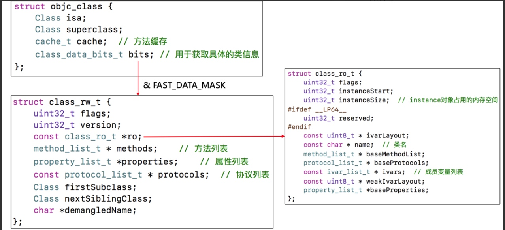
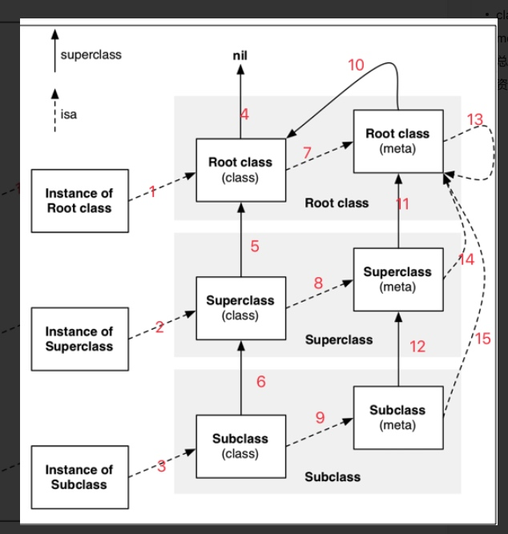
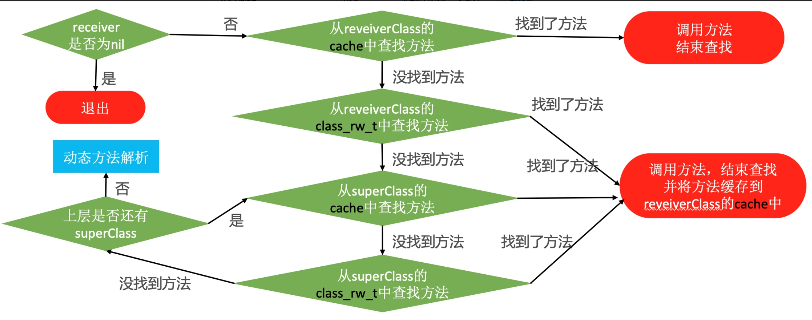

# 底层原理
### 1.指针在32位和64位占用空间大小

<details>
  <summary>点击查看详细内容</summary>
**指针在32位是4字节，在64位是8字节**,[具体思路看blog](https://juejin.cn/post/6844903877960024077)

```
int main(int argc, const char * argv[]) {
	@autoreleasepool {
	    // insert code here...
		NSObject *obj=[[NSObject alloc]init];
		//获得NSobject对象实例大小
		size_t size = class_getInstanceSize(obj.class);
		//获取NSObjet指针的指向的内存大小
		//需要导入：#import <malloc/malloc.h>
		size_t size2 = malloc_size((__bridge const void *)(obj));
		NSLog(@"size:%zu size2:%zu",size,size2);
	}
	return 0;
}

// size:8 size2:16


@interface Person : NSObject
{
	@public
	int _age;//4bytes
	int _age2;//4bytes
}
@property (nonatomic,assign) int level; //4字节
@end
@implementation Person
@end

// 占用空间32字节，三个成员变量和一个指针 4+4+4+8=20,内存对齐是16的倍数，最终是32位，这32位，前20位存储了数据，后12位是默认的`0x000`.


```
> 指针是8字节，指针指向的的内存大小为16字节.
> 实例对象其实是结构体，占用的内存是16的倍数，最少是16，由于内存对齐，实际使用的内存为M,则实际分配内存为(M%16+M/16)*16。实例对象的大小不受方法影响，受实例变量影响。
>
 
</details>

### 2.实例对象和类对象
[文章查看详细](https://juejin.cn/post/6844903878656262151)
<details>
  <summary>点击查看详细内容</summary>




#### 1.对象的isa指向哪里？

- 1. `instance`对象的`isa`指向`class`对象
- 2.`class`对象的`isa`指向`meta-class`对象
- 3.`meta-class`对象的`isa`指向基类的`meta-class`对象
- 4.`class`和`meta-class`的内存结构一样的，只是值不一样

#### 2.OC的类信息存放在哪里？

- 1.对象方法、属性、成员变量、协议信息存放在`class`对象中
- 2.类方法存放在`meta-class`对象中
- 3.成员变量具体值存放在`instance`对象中

</details>


### 3. `+load`和`initialize`有什么区别?
#### 1.`initialize`
- 1.`+initialize`方法会在类第一次接收到消息时调用
- 2.先调用父类的`+initialize`，再调用子类的`+initialize`
- 3.先初始化父类，再初始化子类，每个类只会初始化**1**次
- 1. 通过`objc_msgSend`调用，如果子类 没有实现会调用父类的该方法，有可能父类方法调用了多次，分类的该方法会覆盖类本身方法。

#### 2.`+load`
- 1. 在man函数之前，根据`imp`直接调用而`initialize`man函数之后通过`initialize`调用的。
- 2. `+load`是runtime加载类，分类调用，并且只调用一次。
- 3. `+initialize`方法会在类第一次接收到消息时调用，如果子类没有实现会调用父类的该方法，(有可能父类方法调用了多次，分类的该方法会覆盖类本身方法)
- 4. `initialize`先初始化父类，再初始化子类（可能最终调用父类的`initialize`）.


### 4. 关联对象 `objc_setAssociatedObject`
- 1. 关联对象并不是存储在关联对象的本身内存中
- 2. 关联对象是存储在全局统一的`AssociationsManager`管理的`AssociationsHashMap`中.
- 3. 传入`value =nil`，会移除该关联对线 `AssociationsManager`其实是管理了已`key`为`id` `object`对应的`AssociationsHashMap`

### 5. 消息转发
[消息转发](https://juejin.cn/post/6844903892765900807)

#### 1. 方法查找以及拦截流程
- 1.`objc_msgSend`发送消息，会首先在`cache`中查找，查找不到则去方法列表(顺序是`cache->class_rw_t->supclass cache ->superclass class_rw_t ->动态解析`)
- 2.第二步是动态解析，能在`resolveInstanceMethod`或`+ (BOOL)resolveClassMethod:(SEL)sel`来来拦截，可以给`class`新增实现函数，达到不崩溃目的
- 3.第三步是消息转发，转发第一步可以在`+ (id)forwardingTargetForSelector:(SEL)aSelector`或`- (id)forwardingTargetForSelector:(SEL)aSelector`拦截类或实例方法，能将对象方法转发给其他对象，也能将对象方法转发给类方法，也可以将类方法转发给实例方法
- 4.第三步消息转发的第二步可以在`+ (NSMethodSignature *)methodSignatureForSelector:(SEL)aSelector`或`- (NSMethodSignature *)methodSignatureForSelector:(SEL)aSelector`实现拦截类和实例方法并返回函数签名
- 5.第三步消息转发的第三步可以`+ (void)forwardInvocation:(NSInvocation *)anInvocation`或`- (void)forwardInvocation:(NSInvocation *)anInvocation`实现类方法和实例方法的调用和获取返回值

<details>
  <summary>点击查看详细内容</summary>


</details>