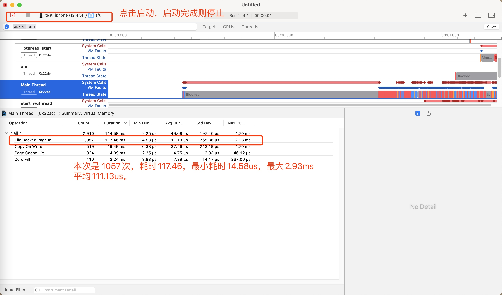

# 二进制重排(静态插幢)

#### [查看抖音原文](https://mp.weixin.qq.com/s?__biz=MzI1MzYzMjE0MQ==&mid=2247485101&idx=1&sn=abbbb6da1aba37a04047fc210363bcc9&chksm=e9d0cd4fdea7445989cf26623a16fc8ce2876bf3bda95a5532bb0e5e5b1420765653df0b94d1&mpshare=1&scene=1&srcid=0316fLf0VRLHLhRPFDH6LuQo&sharer_sharetime=1595570815854&sharer_shareid=ff29c649ff1b5cea91081f325b5ada59#rd)
#### [抖音品质建设-原理-2021.1.25](https://mp.weixin.qq.com/s/3-Sbqe9gxdV6eI1f435BDg)/[抖音实战启动优化](https://mp.weixin.qq.com/s/ekXfFu4-rmZpHwzFuKiLXw)
### [简书二进制重拍步骤](https://www.jianshu.com/p/3f9ed86a45cb)
#### [clang 12 Documentation](https://clang.llvm.org/docs/SanitizerCoverage.html)
### [虚拟内存和物理内存、Page fault](https://www.jianshu.com/p/cbc9f597207e)

### [简书某人学习记录](https://www.jianshu.com/u/e90a0cf1753c)
#### 1. Apple Clang - Custom Compiler Flags
`Other C  Flags`

```
-fsanitize-coverage=func,trace-pc-guard
```
#### 2. Swift Compiler - Custom Flags
如果项目中有`Swift`的话。
在`Other Swift Flags`新增2行代码。

```
-sanitize-coverage=func
-sanitize=undefined
```

### 3. 关键代码 将函数执行顺序写入到文件

用到的头文件

```
#import <dlfcn.h>
#import <libkern/OSAtomic.h>
```

```
// 执行每个函数、block 都会将此函数插入到汇编中，上线打包需要将此桩去掉
// 即取出前面的2个配置文件，新增 orderfile 文件。

void __sanitizer_cov_trace_pc_guard_init(uint32_t *start,
                                                    uint32_t *stop) {
  static uint64_t N;  // Counter for the guards.
  if (start == stop || *start) return;  // Initialize only once.
  printf("INIT: %p %p\n", start, stop);
  for (uint32_t *x = start; x < stop; x++)
    *x = ++N;  // Guards should start from 1.
}

//原子队列
static  OSQueueHead symbolList = OS_ATOMIC_QUEUE_INIT;
//定义符号结构体
typedef struct {
    void *pc;
    void *next;
}SYNode;

void __sanitizer_cov_trace_pc_guard(uint32_t *guard) {
//    if (!*guard) return;  // Duplicate the guard check.
    /*  精确定位 哪里开始 到哪里结束!  在这里面做判断写条件!*/
    // 取出pc，pc是当前函数、文件地址、等参数结构体的指针。
    // 可以使用dladdr取出来
    void *PC = __builtin_return_address(0);
    SYNode *node = malloc(sizeof(SYNode));
    *node = (SYNode){PC,NULL};
    //进入
    OSAtomicEnqueue(&symbolList, node, offsetof(SYNode, next));
    
//    printf("fname:%s \nfbase:%p \nsname:%s \nsaddr:%p\n",
//           info.dli_fname,
//           info.dli_fbase,
//           info.dli_sname,
//           info.dli_saddr);
//
}


/// 这是将记录的函数写入到文件
    NSMutableArray <NSString *> * symbolNames = [NSMutableArray array];
    
    while (YES) {
        SYNode * node = OSAtomicDequeue(&symbolList, offsetof(SYNode, next));
        if (node == NULL) {
            break;
        }
        Dl_info info;
        dladdr(node->pc, &info);
        NSString * name = @(info.dli_sname);
        BOOL  isObjc = [name hasPrefix:@"+["] || [name hasPrefix:@"-["];
        NSString * symbolName = isObjc ? name: [@"_" stringByAppendingString:name];
        [symbolNames addObject:symbolName];
    }
    //取反
    NSEnumerator * emt = [symbolNames reverseObjectEnumerator];
    //去重
    NSMutableArray<NSString *> *funcs = [NSMutableArray arrayWithCapacity:symbolNames.count];
    NSString * name;
    while (name = [emt nextObject]) {
        if (![funcs containsObject:name]) {
            [funcs addObject:name];
        }
    }
    //干掉自己!
    [funcs removeObject:[NSString stringWithFormat:@"%s",__FUNCTION__]];
    //将数组变成字符串
    NSString * funcStr = [funcs  componentsJoinedByString:@"\n"];
    
    NSString * filePath = [NSTemporaryDirectory() stringByAppendingPathComponent:@"hank.order"];
    NSData * fileContents = [funcStr dataUsingEncoding:NSUTF8StringEncoding];
    [[NSFileManager defaultManager] createFileAtPath:filePath contents:fileContents attributes:nil];
    NSLog(@"%@",funcStr);
```

#### 4. Linking

将静态插装生成的order文件复制到工程文件根目录，然后配置下。

让编译函数的顺序按照该文件的先后顺序进行编译，`Build Settings->Order File`。否则按照`Build Phases->Compile Sources`的先后顺序进行编译。

```
./FY.order
```

#### 5. 查看效果

在`Instruments->system Trace`中测试启动`page falut`,次数和耗时。




## 总结

> 二进制重排，在启动的路径触发的`page in`次数的数量，会影响启动时间，如果`page in` 次数不上万，则此操作可以忽略，如果达到了**10万**次级别，则可以尝试。
> 
> 我们APP 次数平均在2000多次，平均每次`page in` **0.2ms**，一共**0.4s**，完全在测试不出来。
> 