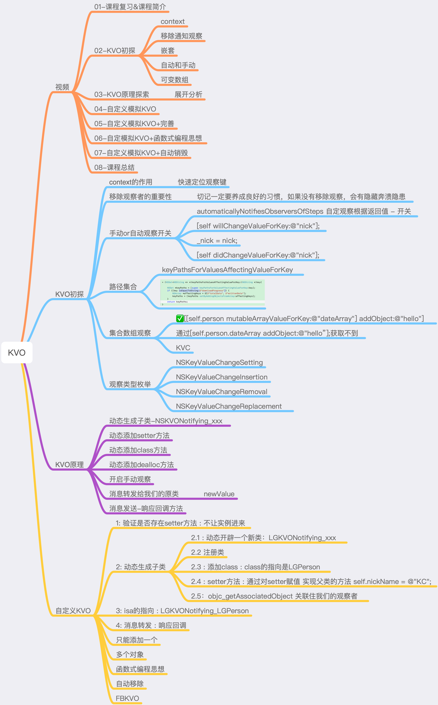
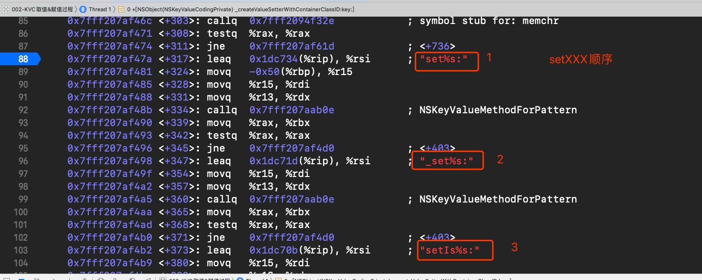
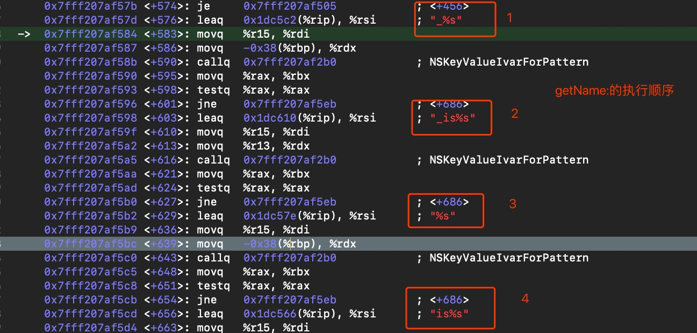
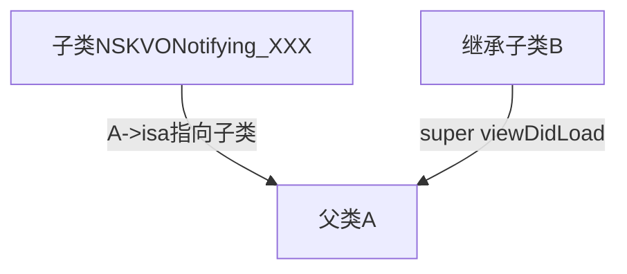
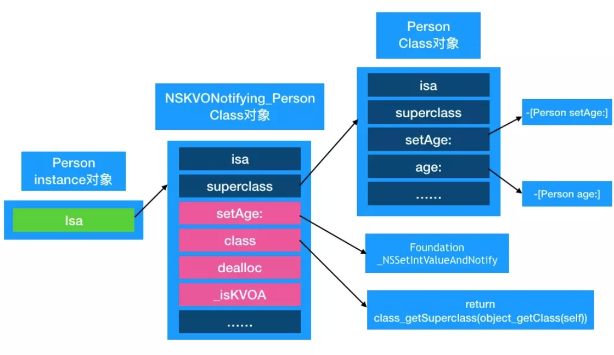

# KVC&KVO
### 1.KVC&KVO 知识图
<details>
  <summary>点击查看详细内容</summary>
  
  
* 

</details>

## 2.KVC

```
  // 4:KVC - 访问非对象属性
    ThreeFloats floats = {1., 2., 3.};
    NSValue *value  = [NSValue valueWithBytes:&floats objCType:@encode(ThreeFloats)];
    [person setValue:value forKey:@"threeFloats"];
    NSValue *reslut = [person valueForKey:@"threeFloats"];
    NSLog(@"%@",reslut);
    
    ThreeFloats th;
    [reslut getValue:&th] ;
    NSLog(@"%f - %f - %f",th.x,th.y,th.z);
    
    // 5:KVC - 层层访问
    LGStudent *student = [[LGStudent alloc] init];
    student.subject    = @"iOS";
    person.student     = student;
    [person setValue:@"大师班" forKeyPath:@"student.subject"];
    NSLog(@"%@",[person valueForKeyPath:@"student.subject"]);
```
## 函数调用优先级顺序
### 原理 setXXX
- 1. `setName:`
- 2. `_setName:`
- 3. `setIsName:`





### 原理 getXXX
- 1. `getName:`
- 2. `_name:`
- 3. `isName:`
- 4. `_isName:`

`成员变量的查找顺序`



## 3. KVO
[apple 文档](https://developer.apple.com/library/archive/documentation/Cocoa/Conceptual/KeyValueObserving/KeyValueObserving.html#//apple_ref/doc/uid/10000177i)

### 1.`[obj addObserver:forKeyPath:options:context:]`中的`context`有什么用？
<details>
  <summary>点击查看详细内容</summary>
利用`context`来区分不同的对象相同的`keypath`的值,平时穿NULL，多个对象被观察，使用指针来区分即可。

```
	static NSString *KPersonKey=@"KPersonKey";
	static void* personKey = &KPersonKey;
    [self.person addObserver:self forKeyPath:@"nickName" options:(NSKeyValueObservingOptionNew) context:&personKey];
```

</details>


### 2. 需要在dealloc中移除观察者吗？
需要，如果被观察的是单例，容易发送崩溃，野指针。

### 3. 通过automaticallyNotifiesObserversForKey：来改变是否自动观察
`YES: `自动观察,系统新建子类`NSKVONotifying_XXX`来重写需要观察的属性`setter`方法和`getClass`。
`NO：` 需要手动`willChangeForKey：`来触发。系统不会自动新建子类。

当然也可以根据`key`的值来判断是否需要新建子类。

```
+ (BOOL)automaticallyNotifiesObserversForKey:(NSString *)key{
	return  NO;
}
```

### 4. 无侵入埋点 利用KVO新建立的子类，给子类添加方法，调用`viewDidLoad`的时候，是直接调用子类的`ViewDidLoad`方法，从而避免子类继承父类调用`super ViewdidLoad`的话，重复计算的问题。





