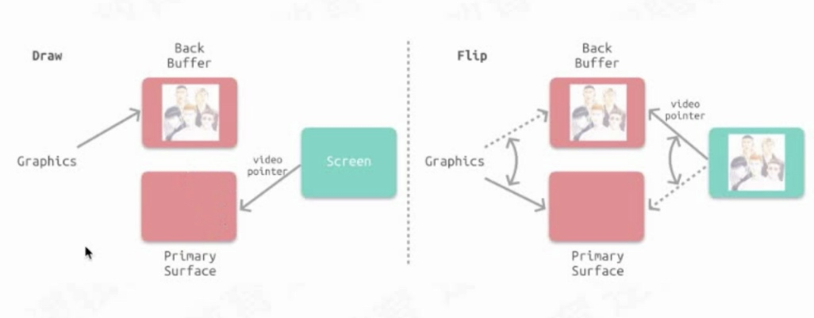
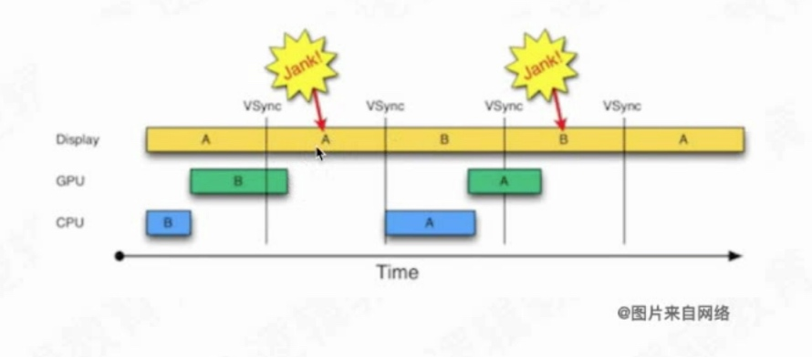
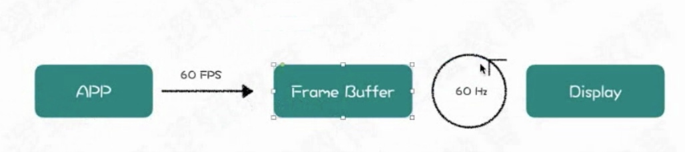
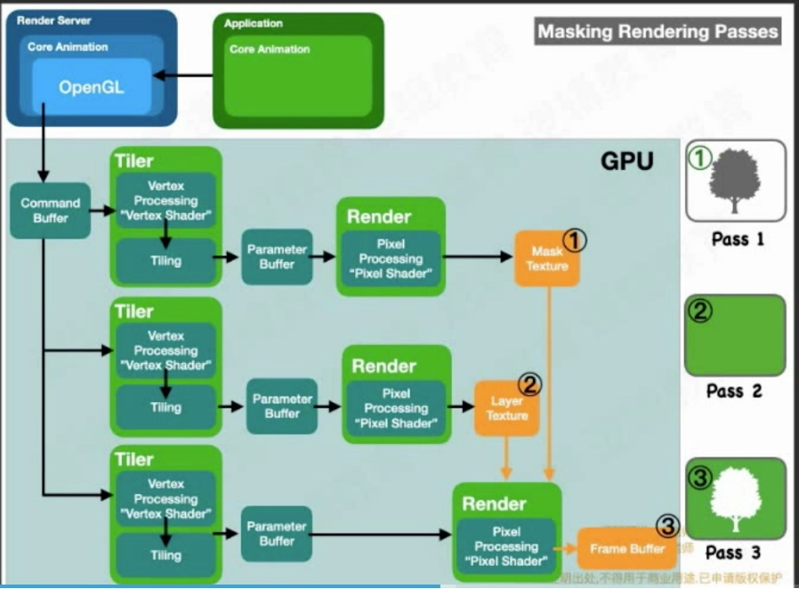
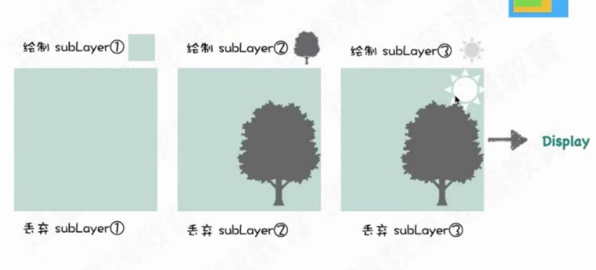
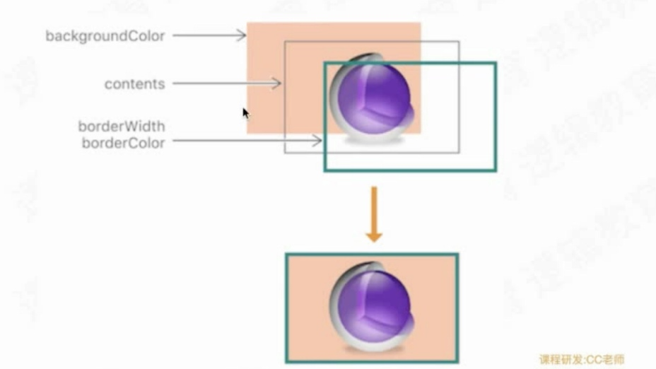

# 离屏渲染
[即刻团队离屏渲染](https://zhuanlan.zhihu.com/p/72653360)
## 1. 屏幕成像和卡顿问题

`UIImage` 在`CPU`解码，出现在赋值非`UIImageView`阶段。

#### 1.1 当屏幕出现撕裂是什么问题造成的？

 上一帧图片没显示完，下一帧图片已提交上来，**单换冲问题**。
 

#### 1.2 双缓冲区

1. 垂直同步： 当第一帧完全显示出来，然后再展示下一帧，不会出现撕裂问题。其实相当于加了一把锁。

当新的帧提交过来，保存到`Back Buffer`中，下次展示`Back Buffer`。如下图所示：

#### 1.3 掉帧
当 `A` 帧在展示完毕的时候，`B`还没有准备好，则继续展示`A`帧，则会出现掉帧。

#### 1.4 双帧缓冲区

光栅化： 确定图形在屏幕中需要哪些像素被着色。
片源着色器：图形在屏幕中说色。

### 2. 普通渲染

### 3. 离屏渲染

开辟离屏缓冲区

**图层合并会触发**

 做蒙版造成离屏渲染。
 - ① 黄色区域就是离屏渲染缓冲区，需要先开辟离屏缓冲区存储🌲的数据
 - ② 开辟要展示的Layer
 - ③ 需要①和②合并成一个新的展示的Layer，耗费性能。

 
 
 
##  触发离屏渲染
 
 1. `UIImageView` 设置背景色和`Image`，和圆角则会触发。不设置背景颜色则不会触发。
 2. `mask` 遮罩或阴影
 3. 多个效果合成一个效果
 4. `view add`多个子`view`，一个`view`影响到其他的`view`，则会触发。
 5. 当光栅化可以被复用，则开启光栅化会提高性能，假如不能复用，则降低效率。因为每次都生成新的离屏缓冲区，而且没复用，则没必要开启光栅化。
 6. **按钮设置图片+圆角则会触发(原因是有默认背景色),或者背景色+title** 背景色和图片，2个控件需要合并。

## 如何避免呢
1. 圆角可以 使用`UIBezierPath`和`CAShapeLayer`可以避免。
2. 或者使用图片。

 
 
 
 **多个图层(CALayer)需要合并，则会触发离屏渲染**

 

**背景颜色也是一个控件。**

- `shouldRasterize`的主旨在于降低性能损失，但总是至少会触发一次离屏渲染。如果你的`layer`本来并不复杂，也没有圆角阴影等等，打开这个开关反而会增加一次不必要的离屏渲染
离屏渲染缓存有空间上限，最多不超过屏幕总像素的2.5倍大小
- 一旦缓存超过100ms没有被使用，会自动被丢弃
- 