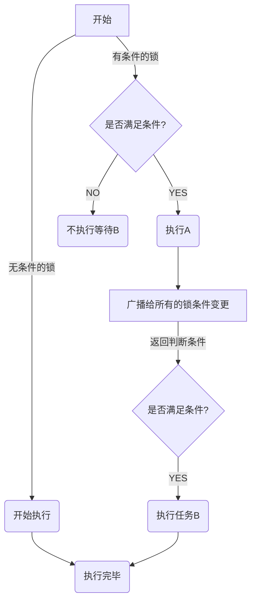

# Lock 锁
互斥锁： 是一种用于多线程编程中，防止两条线程同时对同一个公共资源进行读写机制，该目的通过将代码切片成一个要给临界区而达成目的。

### 1. dispatch_async @synchronized 使用
 <details>
  <summary>点击查看详细内容</summary>

```
__block NSObject *obj =[NSObject new];
for (int i =0; i <100000; i++) {
	dispatch_async(dispatch_get_global_queue(0, 0), ^{
		@synchronized (obj) {
			obj=[NSObject new];
		}
	});
}
```


####  会有什么问题？
`synchronized`是以`obj`地址为存储在全局的`hashTable`确定一个锁的，当多线程都访问`[NSObject new]`会触发多个`release`，**导致`obj=nil`,那么这个锁值变了，则锁会失效,线程不再安全**，，应该还一个不会变的值，比如`self`,或者使用`NSLock`等其他锁。

```
当obj ==nil，则不加锁。
int objc_sync_enter(id obj)
{
    int result = OBJC_SYNC_SUCCESS;

    if (obj) {
        SyncData* data = id2data(obj, ACQUIRE);
        assert(data);
        data->mutex.lock();
    } else {
        // @synchronized(nil) does nothing
        if (DebugNilSync) {
            _objc_inform("NIL SYNC DEBUG: @synchronized(nil); set a breakpoint on objc_sync_nil to debug");
        }
        objc_sync_nil();
    }

    return result;
}
```

</details>

### 2. atomic
自旋锁锁住该属性，会消耗更多资源，性能更低，要比nonatomic慢20倍。
### 3. spinlock
性能问题 已弃用 iOS10
### 4. @synchronized

自旋锁，可递归锁，已尾箱地址存储到全局map中，第二次去创建锁则从cached获取该锁，比`NSRecursiveLock`递归锁性能好。

### 5. NSRecursiveLock 递归锁


### 6. NSLock 
互斥锁，底层是封装是`pthread_mutex_lock(mutex)`，不可递归，否则无限等待导致阻塞。

### 7. NSConditionLock 条件锁

内部封装了`NSCondition`,当不符合条件则调用[xx lock] and [xx wait];




```objc

// 条件数量
NSConditionLock *conditionLock = [[NSConditionLock alloc] initWithCondition:2];
dispatch_async(dispatch_get_global_queue(DISPATCH_QUEUE_PRIORITY_HIGH, 0), ^{
	
	/// 需要条件==1，才可进入到该任务，否则在等待
	///[conditionLock lockWhenCondition:1 beforeDate:[NSDate date]];
	/// 相当于内部调用了了 条件锁的lock和wait。
	///[NSCondition lock];
	///[XXX wait];
   [conditionLock lockWhenCondition:1];
   NSLog(@"线程 1");
   [conditionLock unlockWithCondition:0];
});
    
dispatch_async(dispatch_get_global_queue(DISPATCH_QUEUE_PRIORITY_LOW, 0), ^{
   
	/// 需要条件==2，才可进入到该任务，否则在等待
   [conditionLock lockWhenCondition:2];
   
   NSLog(@"线程 2");
   
   [conditionLock unlockWithCondition:1];
});
dispatch_async(dispatch_get_global_queue(0, 0), ^{
   
	/// 无需条件 即可进入到该任务
   [conditionLock lock];
   NSLog(@"线程 3");
   [conditionLock unlock];
});
```

**解决问题：弹窗较多处理，根据弹窗优先级来弹窗，每个弹窗有自己的条件，当第一个已经弹过了直接跳到下一个条件即可。**

### 8. dispatch_semaphore_t 信号量
当`dispatch_semaphore_t`的值设置为`1`，则是单线程，设置为`2`，则是允许2条线程。可以控制流量大小，另外一个控制并发数，则是`NSOperationQueue`。


### 9. 自旋锁与互斥锁
 <details>
  <summary>点击查看详细内容</summary>
  <p> 
  - 自旋锁：一直在不停的访问数据，直到可以访问。
  - 互斥锁：在sleep，等待唤醒。
</p>
</details>


### 10. 读写锁 多读单写
 <details>
  <summary>点击查看详细内容</summary>
  **多读单写，读写互斥。**
  
  - 在写入的时候，进行读操作，则会被阻塞，直到写入完成。
  - 在读的时候，进行写入操作，则会被阻塞，直到读操作完成，才会写入。

```objc
// DISPATCH_QUEUE_CONCURRENT 为并发，栅栏函数配合并发队列才有意义，加入配合同步队列，就不用栅栏函数了，因为本来就是先进先出的执行顺序。
// 1. 并发队列(非全局队列)+栅栏函数
// DISPATCH_QUEUE_CONCURRENT 并发队列
+ (dispatch_queue_t )queue{
	static dispatch_once_t onceToken;
	static dispatch_queue_t queue;
	dispatch_once(&onceToken, ^{
		queue=dispatch_queue_create("test", DISPATCH_QUEUE_CONCURRENT);
	});
	return queue;
}
-(void)write:(dispatch_block_t)block{
	dispatch_queue_t queue = [RWLock queue];
	dispatch_barrier_async(queue, block);
}
-(void)readBlock:(dispatch_block_t)block{
	dispatch_queue_t queue = [RWLock queue];
	dispatch_async(queue, block);
}

// 2. 读写锁 
// 利用pthread_rwlock_t 来加锁和解锁
// pthread_rwlock_trywrlock 带有try字样的只会尝试加锁一次，当锁已被加锁，则失败，之后后边的代码，使用pthread_rwlock_wrlock 则会堵塞线程，直到加锁成功。
#import <pthread.h>

#import <objc/message.h>
#import <malloc/malloc.h>

@interface RWLock (){
	pthread_rwlock_t _rwlock;
}
@end

@implementation RWLock
+ (dispatch_queue_t )queue{
	static dispatch_once_t onceToken;
	static dispatch_queue_t queue;
	dispatch_once(&onceToken, ^{
		queue=dispatch_queue_create("test", DISPATCH_QUEUE_CONCURRENT);
	});
	return queue;
}
-(void)configLock{
	pthread_rwlockattr_t _attr;
	pthread_rwlockattr_init(&_attr);
	
	int ret = pthread_rwlock_init(&_rwlock, &_attr);
	if (ret == 0) {
		NSLog(@"初始化成功");
	}else{
		NSLog(@"初始化失败");
	}
}

-(void)write2{
	//__weak 防止循环引用
	// 
	dispatch_queue_t queue = [RWLock queue];
	__weak typeof(self) __weakSelf=self;
	
	dispatch_async(queue, ^{
		__strong typeof(self) __strongSelf=__weakSelf;
		int retLock = pthread_rwlock_wrlock(&__strongSelf->_rwlock);
		if (retLock == 0) {
			[__strongSelf write];
			pthread_rwlock_unlock(&__strongSelf->_rwlock);
		}else{
			NSLog(@"读操作加锁失败 code:%d ",retLock);
		}
	});
}
- (void)readBlock2{
	
	dispatch_queue_t queue = [RWLock queue];
	__weak typeof(self) __weakSelf=self;
	
	dispatch_async(queue, ^{
		__strong typeof(self) __strongSelf=__weakSelf;
		int retLock = pthread_rwlock_rdlock(&__strongSelf->_rwlock);
		if (retLock == 0) {
			[__strongSelf read];
			pthread_rwlock_unlock(&__strongSelf->_rwlock);
		}else{
			NSLog(@"读操作加锁失败 code:%d ",retLock);
		}
	});
}
-(void)read{
	NSLog(@"read start");
	sleep(2);
	NSLog(@"read end");
}
-(void)write{
	
	NSLog(@"write start");
	sleep(2);
	NSLog(@"write end");
}
-(void)dealloc{
	pthread_rwlock_destroy(&_rwlock);
	NSLog(@"dealloc %s",__func__);
}


/// 3. 根据group来判断进入和完成条件来执行读或者写

```
[查看线程相关的题目](./xiancheng_ti.md)
</details>


### 总结
普通使用`NSlock`，循环的话使用`NSRecursiveLock`,省市的话使用``,注意锁住的对象不能为`nil`，否则不加锁。

- 控制流量：信号量、`NSOperationQueue`
- 控制条件顺序执行：`NSConditionLock`
- 控制递归：`NSRecursiveLock`/`@synchronized`
- 普通加锁`NSlock`/`@synchronized`
- 读写锁：并发非全局队列+栅栏函数、c读写锁、
