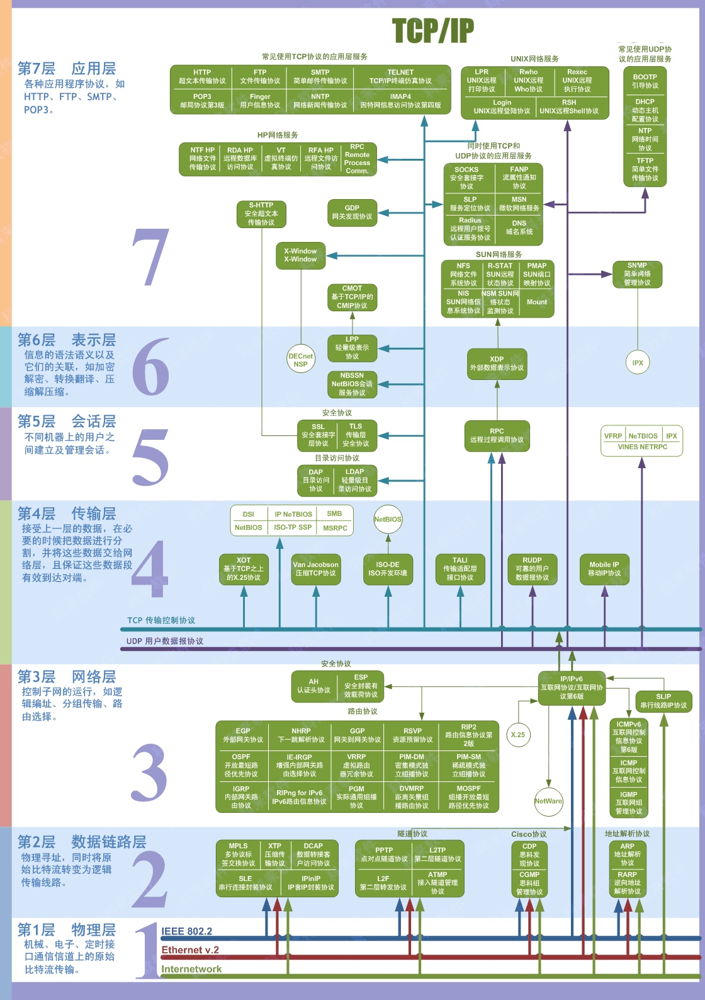

# 网络
## 1. 3次握手
### 1. 详细的
1. 第一次握手:客户端向服务起发出连接请求报文，这时
报文首部中的同部位`SYN=1`,同时随机生成初始序列号 `seq=x`,此时，客户端进入了`SYN-SENT`状态，等待服务器的确认。
2. 第二次握手:服务器收到请求报文后，如果同意连接， 则发出确认报文。确认报文中应该`ACK=1`,`SYN=1`,确认号是`ack=x+1`,同时也要为自己随机初始化一个序列号
`seq=y`,此时，服务器进程进入了`SYN-RCVD`状态，询问 客户端是否做好准备。
3. 第三次握手:客户端进程收到确认后，还要向服务器给出确认。确认报文的`ACK=1,ack=y+1`,此时建立连接， 客户端进入`ESTABLISHED`状态，服务器端也进入 `ESTABLISHED`状态。


### 2. 简单的
1. 第一次握手:客户端给服务器发送一个`SYN`报文。 `SYN=1`是创建连接请求，`seq=x`是包的序号
2. 第二次握手:服务器收到`SYN`报文之后会应答一个`SYN+ACK`报文。

```
`ACK=1`是确认包，`SYN=1`是服务端创建链接请求，`seq=y`是服务端的包的序号,`ack=x+1`，收到了客户端的包的序号
```
4. 第三次握手:客户端收到`SYN+ACK`报文之后，会应答一个`ACK`报文。

```
 确认包: `ACK=1`。 确认包的序号:`ack=y+1`。  序号+1: `seq=x+1`
 ```


### 三次握手的目的

##### 同步连接双方的**序号**和**确认号**,并交换**TCP窗口窗口大小信息**。


## 2. 四次挥手

[四次挥手文章](https://blog.csdn.net/xyxyxyxyxyxyx/article/details/126183958?spm=1001.2101.3001.6661.1&utm_medium=distribute.pc_relevant_t0.none-task-blog-2%7Edefault%7EYuanLiJiHua%7EPosition-1-126183958-blog-81612379.pc_relevant_3mothn_strategy_and_data_recovery&depth_1-utm_source=distribute.pc_relevant_t0.none-task-blog-2%7Edefault%7EYuanLiJiHua%7EPosition-1-126183958-blog-81612379.pc_relevant_3mothn_strategy_and_data_recovery&utm_relevant_index=1)

1. 第一次挥手:客户端发送一个`FIN`报文，报文中会指定一个序列号。此时客户端处于`CLOSED_WAIT1`状态。

```
FIN=1,seq=x
```
2. 第二次握手:服务端收到`FIN`之后，会发送`ACK`报 文，且把客户端的序列号值`+1`作为`ACK`报文的序列号值， 表明已经收到客户端的报文了，此时服务端处于 `CLOSE_WAIT2`状态。

```
ACK=1,ack=x+1
```
3. 第三次挥手:如果服务端也想断开连接了，和客户端的第一次挥手一样，发给`FIN`报文，且指定一个序列 号。此时服务端处于`LAST_ACK`的状态。

```
FIN=1,seq=y,ack=x+1
```
4. 第四次挥手:客户端收到FIN之后，一样发送一个`ACK`报文作为应答，且把服务端的序列号值`+1`作为自己`ACK`报文的序列号值，此时客户端处于`TIME_WAIT`状 态。需要过一阵子以确保服务端收到自己的`ACK`报文之后 才会进入`CLOSED`状态。

```
ACK=1,ack=y+1,seq=x+1
```
5. 服务端收到`ACK`报文之后，就处于关闭连接了，处于`CLOSED`状态。


#### 四次挥手变成三次可以吗？

```
客户端断开后，有可能服务端还在发送数据，所以第二次挥手（ACK=1，seq=y,ack=x+1）后，
通常仍有数据需要处理并发送，因此 第二次挥手（ACK）与 第三次挥手（FIN）不能合并。

TCP是双工的，都需要单独FIN=1，进行结束监听。
```

## 3. HTTP与HTTPS
**HTTPS=HTTP+TLS/SSL**

在三次握手之后，再进行SSL握手，握手通过之后才能正式进行通信。


#### HTTPS连接建立流程

[https单项认证与双向认证](https://blog.csdn.net/foshengtang/article/details/109111119?utm_medium=distribute.pc_relevant.none-task-blog-BlogCommendFromMachineLearnPai2-1.control&dist_request_id=&depth_1-utm_source=distribute.pc_relevant.none-task-blog-BlogCommendFromMachineLearnPai2-1.control)

 `HTTPS`为了兼顾安全与效率，同时使用了对称加密和非对称加密，在传输的过程中会涉及到三个密钥:服务端的公钥和私钥，用来进行非对称加密客户端生成的随机密钥，用来进行对称加密
 
#### HTTPS 1.2
 
1. 客户端访问`HTTPS`连接。
客户端会会把安全协议版本号、客户端支持的加密算法列表，随机数`C`发给服务端。
2. 服务端发送证书给客户端
服务端接收密钥算法配件后，会和自己支持的加密算法列表进行比对，如果不符合，则断开连接，否则服务端会在该算法列表中，选择一种对称算法、一种公钥算法(具有特定密钥⻓度的`RSA`)和一种`MAC`算法发给客户端。在发送算法的同时还会把数字证书和随机数`S`发送给客户端,还有按照密钥套件要求，生成**椭圆曲线的公钥(Server Params)**发送给客户端。
3. 客户端验证`server`证书
会对`server`公钥进行检查，验证其合法性，如果发现公钥有问题，那么`HTTPS`传输就无法继续。
4. 客户端组装会话密钥
如果公钥合格，按照密码套件要求也生成一个**椭圆曲线的公钥(Client Params)**,用`Client Key Exchange`发送给服务器，那么客户端`ECDHE`算法用`Client Params`和`Server Params`算出`Pre-Master`,最后用`C` `S` `Pre-Master`来算出主密钥。叫做`Master-Secret`。
1. 服务端也有了材料进行组装，`Master-Secret`=PRF(`C`+`S`+`Pre-Master`)。
2. 数据传输

#### HTTPS 1.3

1.2 握手消息会花费2-RTT，1.3中，只需要一个1-RTT，1.3中删除了`Key Exchagne`消息，效率提高了一倍。

1. 客户端完成`TCP`握手后，`Clicent hello`，带有的参数有随机数`C`,密码套件，密钥交换算法参数`key_share`
2. 服务端接受了`C`,`Client Params`,然后服务端生成随机数`S`和`Server Params`,首先利用`Client Params`和`Server Params`算出`Pre-master`,然后用随机数`C S Pre-master`计算得出主密钥，服务端发送`Change Cipher Spec`给客户端，表示后续数据是加密数据。后续的扩展信息都用主密钥加密发送。这些数据都在一个包里，所以省掉了`1-RTT`。提高了效率。
3. 客户端首先受到随机数`S`和`Server Params`,`Client Params`和`Server Params`算出`Pre-master`，然后利用`C S pre-master`计算得出主密钥，后续的接受到的数据用主密钥解密即可。
4. 客户端发送`Change Cipher Spec`给服务端，表示后续数据是加密数据。


## 4. TCP与UDP

1. **TCP**:面向连接、传输可靠(保证数据正确性，保证数据 顺序)用于传输大量数据(流模式)、速度慢，建立连接 需要开销较多(时间、系统资源)。
2. **UDP**:面向非连接、传输不可靠，用于传输少量数据(数 据包模式)、速度快。

[一文搞懂TCP与UDP](https://www.cnblogs.com/fundebug/p/differences-of-tcp-and-udp.html)


## ** OSI七层
物理层、链路层、网络层、传输层、会话层、表示层、应用层。

`HTTP` 属于应用层。
`TLS` `SSL` 属于会话层。
`TCP/UDP` 属于传输层层。



### 5. 如何确认CA证书有效性

首先从手机获取信任的根证书，拿到根证书的公钥，然后解密CA证书，解密出来的信息A，用证书规定的加密算法加密得到数字签名，拿这个数字签名和证书存在的签名做对比，一致则未修改，不一致则被篡改。
