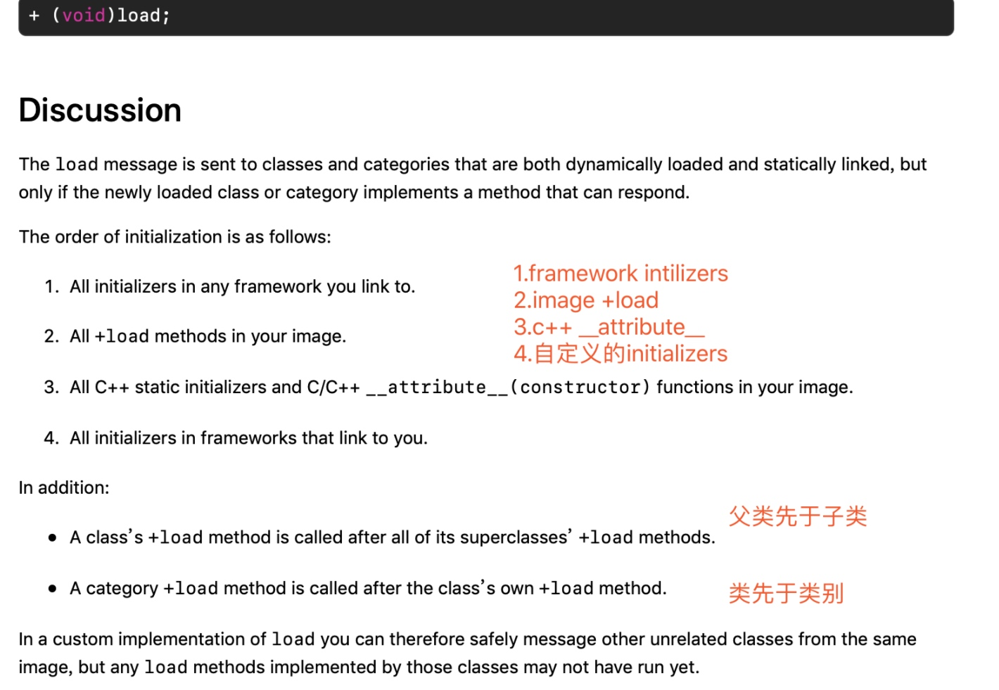
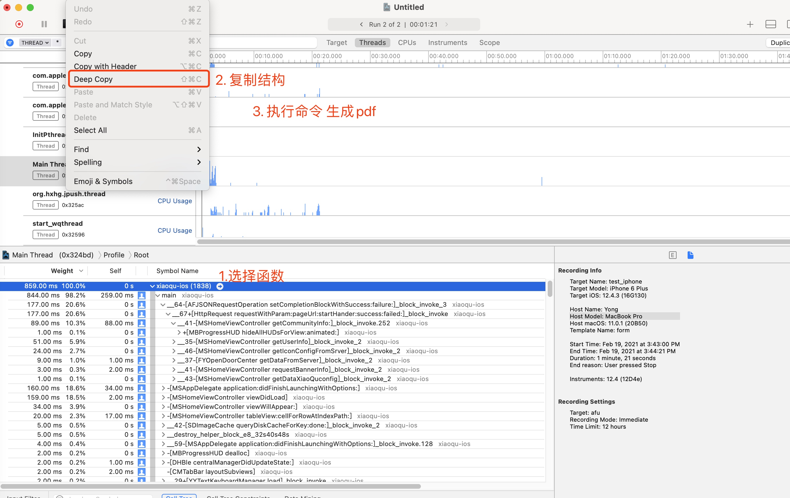

# 启动

## 1. 启动顺序

  
点击查看详细内容

  - 1. `framework initializers`
  - 2. image `+load`
  - 3. `c/c++ __attribute__`
  - 4. 所有 `initalizers`

  > `+load` 函数父类先于子类，类先于类别。
  
  

### 2. 火焰图

火焰图swift插件

https://github.com/lennet/FlameGraph

>使用这个插件，然后配合instruments的App Launch，选择主线程，deep copy，并执行命令即可生成火焰图。
> 首先安装插件`Mint`，使用`Mint`安装`FlameGraph`，然后生成火焰图。

#### 1. 手动复制函数结构

#### 2. 命令
`swift run FlameGraph ./a.pdf`
