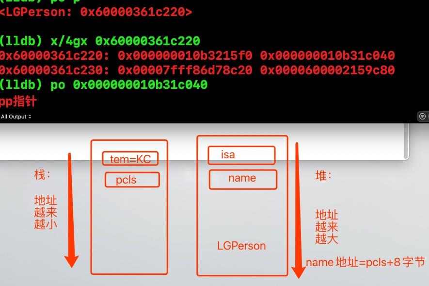

# Runtime
`runtime`是有`c`和`c++`汇编实现的一套`API`，为`oc`语言加入了面向对象，运行时的功能.

运行时(`Runtime`)是指数据类型的确定有编译时推迟到了运行时，举个例子：`extension-category`的区别

平时编写的oc代码，在程序运行过程中，其实最终将转换成`Runtime`的`c`语言代码`runtime`是`Object-c`的幕后工作者。

### 1. 方法的本质sel是什么，IMP是什么？他们的关系是什么？

<details>

方法的本质：发送消息，发送消息有几个流程

- 1. 快速查找(`objc_msgSend`),`cache_t`缓存消息
- 2. 慢查找，递归自己|父类_`loopUpImpOrForward`
- 3. 查找不到消息：动态消息解析——`resolveInstanceMethod`
- 4. 消息快速转发——`forwardingTargetForSelector`
- 5. 消息慢速转发——`methodSignatureForSelector` & `forwardInvocation`

`sel`是方法编号，在`read_images`期间就进入内存，`imp`是函数指针，找到`imp`，就是找函数的过程。

</details>

### 2. self 和super区别
<details>

```
	
/// 原理 (id self,sel,_cmd)
/// 所以结果是 FYPerson FYPerson
Class cls = [self class];
Class tcls = [super  class];
NSLog(@"%@ %@",cls,tcls);
```
##### 输出 `FYPerson FYPerson`,原因是源码`[obj class]`获取当前的`isa`指针.接收者仍然是`self`,所以最终是`FYPerosn`


> `[self class]`就是发送消息，`objc_msgSend`,消息接收者是`self`,方法编号是`class`。
> 
> `[super class]` 本质就是`objc_msgSend`,消息的接收者还是`self`,方法编号`class`,只是`objc_msgSendSuper`会更快，直接跳过`self`去查找。
> 
</details>


### 3. 能否向编译后得到的类中增加实例变量，能否向运行时创建的类中添加实例变量

<details>
- 1. 不能向编译后得到的类中增加实例变量
- 2. 只要没有注册到内存还是可以添加的

> 原因是：我们编译好的实例变量存储的位置`ro`，一旦编译完成，内存结构就完全确定就无法修改。

> 可以通过添加关联变量来实现这个功能。属性+方法。
</details>

### 4. __weak 原理
<details>

`__weak`修饰的变量,会将该变量添加到全局的`hash`表中，在`VC` `delloc `函数中自动销毁。
#### 4.1 系统如何实现weak的为什么可以自动置nil。

- 1. 通过`SideTable`找到我们的`weak_table`
- 2. `weak_table`根据`referent`找到或者创建`weak_entry_t`
- 3. 然后`append_referrer(entry,referrer)`将我的新弱引用的对象加进去`entry`
- 4. 最后`weak_entry_insert`把`entry`加入到我们的`weakTable`


</details>


### 5 .内存平移

```
NSString *tem = @"KC";
//	int a = 100;
id pcls = [LGPerson class];
void * pp= &pcls;
[(__bridge id)pp saySomething];
    


@interface LGPerson : NSObject
@property (nonatomic, copy)NSString *name;
- (void)saySomething;
@end
@implementation LGPerson
- (void)saySomething{
	NSLog(@"NB %s - %@",__func__,self.name);
}
@end
```

<details>


相当于还是`objc_msgSend(LGPerson.class,@selector(saySomething),_cmd)`;
本质和`[[LGPerson alloc]saySomething]` 一样。
`	 pp `指向`pcls`，实例对象的`isa`指针也是指向`pcls`，所以效果一样。
	
打印的 `person.name` 值为`KC`，也就是`tem`的值。
寻找属性的地址就是按照`class`的布局，根据`isa`的指针向前切换8字节，因为`pp`指向的指针是`pcls`，在栈上，所以平移8字节，就是找到了`tem`，所以输出的值是`tem`的值。
因为`class`的布局是按照堆上的规则布局的，地址越来越大。
所以刚才的平移8自己是`plcs`+**8**字节的地址，就是指针向上平移8字节，最终找到了`tem`指针。
	

</details>


