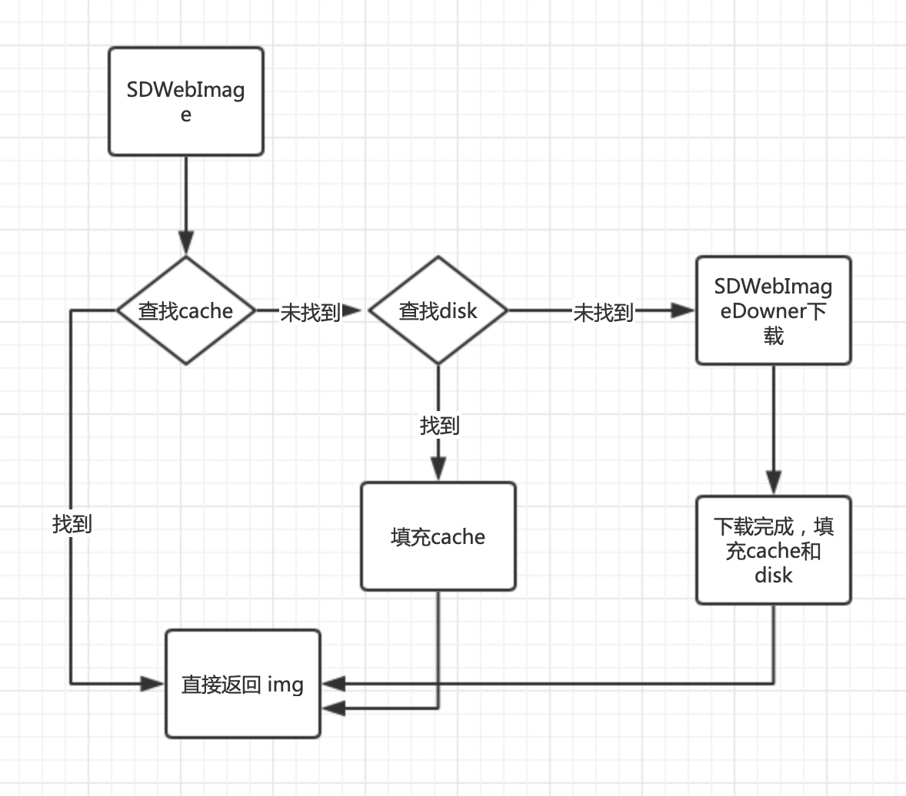

# SDWebImage 的图片加载过程

### 1. 查看缓存
#### 1.1 缓存命中
1.1.1 返回图片
1.1.2. 更新 UIImageView
#### 1.2 缓存未命中
1.2.2 异步下载图片
1.2.3 加入缓存
1.2.4 更新 UIImageView


### 2.SDWebImage 如何为 UIImageView 添加图片(面试回答)？

`SDWebImage` 中为 `UIView` 提供了一个分类叫做 `WebCache`, 这个分类中有一个最常用的接口, `sd_setImageWithURL:placeholderImage:`, 这个分类同时提供了很多类似的方法, 这些方法最终会调用一个同时具有` option progressBlock completionBlock `的方法, 而在这个类最终被调用的方法首先会检查是否传入了 `placeholderImage `以及对应的参数, 并设置 `placeholderImage.`

然后会获取 `SDWebImageManager `中的单例调用一个 `downloadImageWithURL:... `的方法来获取图片, 而这个 `manager `获取图片的过程有大体上分为两部分, 它首先会在 `SDWebImageCache `中寻找图片是否有对应的缓存, 它会以 `url` 作为数据的索引先在内存中寻找是否有对应的缓存, 如果缓存未命中就会在磁盘中利用` MD5` 处理过的 `key` 来继续查询对应的数据, 如果找到了, 就会把磁盘中的缓存备份到内存中.

然而, 假设我们在内存和磁盘缓存中都没有命中, 那么` manager` 就会调用它持有的一个 `SDWebImageDownloader` 对象的方法 `downloadImageWithURL:...` 来下载图片, 这个方法会在执行的过程中调用另一个方法 `addProgressCallback:andCompletedBlock:fotURL:createCallback:` 来存储下载过程中和下载完成的回调, 当回调块是第一次添加的时候, 方法会实例化一个 `NSMutableURLRequest` 和` SDWebImageDownloaderOperation`, 并将后者加入 `downloader `持有的下载队列开始图片的异步下载.

而在图片下载完成之后, 就会在主线程设置 `image `属性, 完成整个图像的异步下载和配置。



### 关键点
- 1. 多处使用`dispatch_semaphore_t`保证线程安全。`IOQueue`采用**同步队列**。
- 2. 使用`operationQueue`添加`operation`来依次控制并发和下载顺序，使用`[lastoperation depend:newoperation]`来控制`FIFO`和`LIFO`策略。
- 3. 多处`block`使用`// strongly self，保证生命周期SDWebImageDownloader *sself = wself;if (!sself) return;`来保证生命周期，在执行过程中不被中断，如果`self=nil`则直接`return`。
- 4. 开发者配置了`disk`和过期时间，在进入`background`和关闭`APP`的时候进行删除(存储和读取最好和`LRU`结合，提高**删除效率**)。
- 5. 使用关联对象来加速读取速度，存取的`url`/`Tranform`/`progress`/`opertionKey`等都是存储在当前对象的。
- 6. `self.weakCache = [[NSMapTable alloc] initWithKeyOptions:NSPointerFunctionsStrongMemory valueOptions:NSPointerFunctionsWeakMemory capacity:0];`使用`MapTable`保存弱引用，提高缓存命中率。
- 7. 按照`memory->disk->downFromUrl`的顺序读取`img`。
- 8. 在图片命中之后，展示的时候根据`obj`的关联对象->`class Tranform`来展示动画或者直接展示。
- 9 . 如何保证一定在主线程更新？
[查看详细实现](./SDWebImageManager.md)

- 10 . 利用上下文保存各种信息`typedef NSDictionary<SDWebImageContextOption, id> SDWebImageContext`
- 11 . 相同`UIImageView`同时下载多个不同`url`,则后者下载，前者则取消下载。
- 12 . 通过`[SDWebImageManager setDefaultImageCache:(id<SDImageCache>)defaultImageCache]`和`[SDWebImageManager setDefaultImageLoader:(id<SDImageLoader>)defaultImageLoader]`来保证扩展能力，可以自己实现`id<SDImageLoader> `或者`id<SDImageCache>`来使用自己的插件，[查看详细实现](./SDWebImageManager.md)。
- 13 . 通过宏来定义使用的锁，iOS10以前使用**自旋锁**`OSSpinLockLock`,之后使用**互斥锁**`os_unfair_lock_lock`[查看详细实现](./SDWebImageManager.md)
- 14 . 在`ImageCahche`配置磁盘读写操作都加入到同步队列中`ioQueue`,`memoryCache`使用的自旋锁，效率更高。


#### 性能角度
- 1. 设计读取缓存三级缓存提高命中率。
- 2. `CGContextDrawImage`解码成大小合适的，根据当前设备重绘除可用的位图。
- 3. 圆角使用贝塞尔曲线避免离屏渲染。
- 4. 内存缓存使用自旋锁，`diskCache`使用同步队列。


### `YYCache` 对比:为什么内存缓存用自旋锁，磁盘缓存使用`dispatch_semaphore`呢？

- `OSSpinLock` 自旋锁，性能最高的锁。原理很简单，就是一直` do while `忙等。它的缺点是当等待时会消耗大量` CPU` 资源，所以它不适用于较长时间的任务。对于内存缓存的存取来说，它非常合适。

- `dispatch_semaphore` 是信号量，但当信号总量设为` 1` 时也可以当作锁来。在没有等待情况出现时，它的性能比 `pthread_mutex`还要高，但一旦有等待情况出现时，性能就会下降许多。相对于 `OSSpinLock` 来说，它的优势在于等待时不会消耗` CPU` 资源。对磁盘缓存来说，它比较合适。
- 设置超时时间，从`lru->tail`删除即可。
- 设置`count`阈值或者`cost`阈值直接从尾部删除。过期时间在进入后台删除。
- 释放`obj`对象在子线程。
- 使用`while(!finish){}`10ms访问一次`        if (pthread_mutex_trylock(&_lock) == 0) {}`
- 通过设置`shouldRemoveAllObjectsWhenEnteringBackground`来控制是否在进入后台删除所有缓存。或者`shouldRemoveAllObjectsOnMemoryWarning`在内存警告的时候删除所有对象。
- `YYCache`双向链表实现的`LRU`比系统的多了一个访问时间，在访问的时候，把该节点换到头部，删除的时候从尾部删除(尾部访问时间更久)，也更符合`LRU`思想。
- 
#### YYCache 多线程 职责单一

- `memoryCahce`在进入后台删除过期资源在一个自定义的**同步队列**，优先级为`low`，能耗更低。
- 销毁对象在全局队列，优先级为`low`，性能更好。


#### 设计角度
- 1. `SDImageCache`、`SDMemoryCache`、`SDMemoryCache`通过`config`来配置协议。设计成协议，可热插拔，单独实现缓存的，然后让`SD`走自己的缓存插件。


```objc
 // 设置下载操作的优先级操作，需要根据下载模式枚举来判断
if (options & SDWebImageDownloaderHighPriority) {
    operation.queuePriority = NSOperationQueuePriorityHigh;
} else if (options & SDWebImageDownloaderLowPriority) {
    operation.queuePriority = NSOperationQueuePriorityLow;
}

// 向下载操作的队列中增加当前操作
[wself.downloadQueue addOperation:operation];
if (wself.executionOrder == SDWebImageDownloaderLIFOExecutionOrder) {
    // 如果执行顺序为后进先出的栈结构
    // 则将新添加的 operation 作为当前最后一个 operation 的依赖，按照顺序逐个执行
    [wself.lastAddedOperation addDependency:operation];
    wself.lastAddedOperation = operation;
}
```

#### LRU 淘汰算法
> `LRU`是`Least Recently Used`的缩写，即最近最少使用，是一种常用的页面置换算法，选择最近最久未使用的页面予以淘汰。
> 


一般用于`cache`缓存中，当缓存大于`10M`的时候，将时间久的缓存淘汰掉，当`img`被使用的时候，将该`img`调整到头部，更新访问时间。

`MapTable`+`Node`
**双向链表+字典**

保存头部`head=Node();`,新增的node，`head->next=Node()`,然后将`url`作为`key`保存到`HashTable`中，当进入到后台的时候从头部遍历访问，如果该`node`超时，则进行删除，如果已遍历的文件大小累计超过设置的阈值，则后续的`node`从`HashMap`删除.

```objc
@interface _YYLinkedMapNode : NSObject {
    @package
    __unsafe_unretained _YYLinkedMapNode *_prev; // retained by dic
    __unsafe_unretained _YYLinkedMapNode *_next; // retained by dic
    id _key;
    id _value;
    NSUInteger _cost;
    NSTimeInterval _time;
}
@end
```
