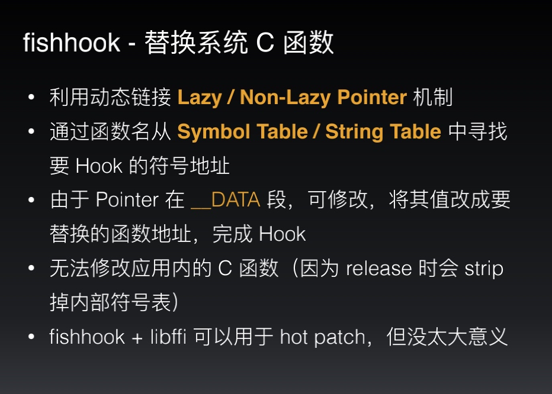

# 优势
熟悉底层原理，了解flutter，了解一般数据结构

### 1. 内存优化 
1. 图片下采样
2. 离屏渲染

### 2. 启动优化
1. 二进制插桩

### 3. 崩溃处理
1. 让`APP`不立即次崩溃，可以手机崩溃堆栈发送到服务器,

```objc
CFRunLoopRef runloopRef=CFRunLoopGetCurrent();
	
while (!dismiss) {
	for (NSString * item in (__bridge NSArray *)CFRunLoopCopyAllModes(runloopRef) ) {
		CFRunLoopRunInMode((CFStringRef)item, 0.01, false);
	}
}
```
### 4. runtime的实际应用

1. 利用关联对象存储时间，然后在`+load`调换`hitTest`函数，根据点击的时间间隔来判断是否响应该次点击。
2. `jsonModel`利用`runtime`和`kvc`来实现的
3. `KVO`其实内部就`runtime`动态生成了`NSKVONotifying_XXX`类，重写了获取`class`的方法。
4. 做了一个动态库来记录`method_exchange`的历史记录,需要将该动态库调整到第一个才行。

### 5. 读写锁 与缓存
1. `momeryCache`利用自旋锁，性能更好
2. `diskCache`利用互斥锁就能满足需求
3. 读写常用文件需要家读写锁来防止资源竞争
4. 读写锁是**多读单写，读写互斥**。
5. [FYML 记录方法交换历史](https://github.com/ifgyong/FYMSL)
6. [fishhook原理](https://www.jianshu.com/p/d4dd4eb27b50)
7. `os_un_fair_lock`自旋锁，`NSLock`是互斥锁




> 首先遍历`load_com`，找到`link_edit`基地址/`systab`和`dysytab`确认2个`section`的偏移量，，然后遍历一次找到`symtab`和`dysytab`中的符号，将符号指向需要替代的地址。

> 首先是`image`已经读入系统，然后修改`image`中的符号表和动态符号表中的函数地址，指向需要的函数即可。
> 
> 修改之前调用还是系统函数，修改之后调用自己的函数。
> 
> 可以根据自定义函数的地址和**section**范围来判断是否被**中间人**`hook`了。


### 6. flutter [做了一个动画库 包含了30多个动画](https://github.com/ifgyong/flutter_easyHub),还有[QQ气泡动画](https://github.com/ifgyong/flutter_qq_bubble)
### 7. py做的自动化数据校验功能，生成各种尺寸Icon脚本
### 8. 
